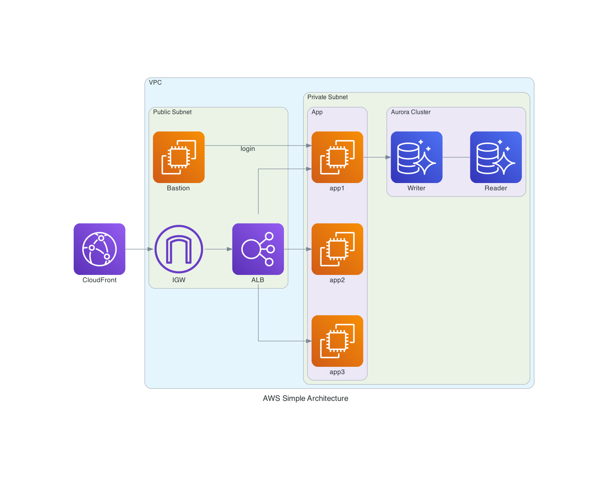

# Diagrams as Code Example

For example, generate aws simple architecture of [diagrams](https://github.com/mingrammer/diagrams). 

## Diagram



## Install

```
# use pip
pip install diagrams

# use poetry
poetry install diagrams
```

## Run

```
python aws_simple_architecture.py
```